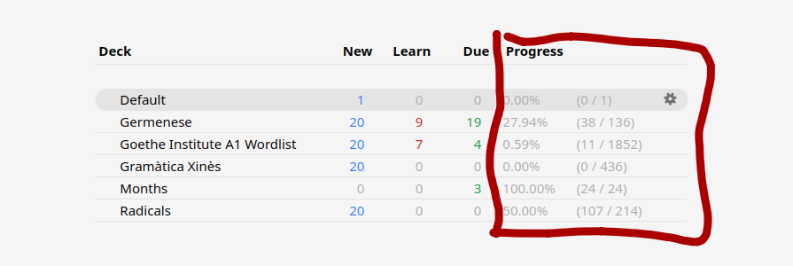

# Deck Progress Indicator 

This add-on adds a progress column to your Anki deck browser showing the percentage and absolute count of cards you've seen (non-new cards) for each deck.



## Installation

### Option 1: Install from Source
1. Clone or download this repository
2. Navigate to the project directory in your terminal
3. Create the add-on package:
   ```bash
   zip -r DeckProgressIndicator.ankiaddon . -x "*.git*" "*.DS_Store*" "__pycache__/*" "*.pyc"
   ```
4. Open Anki
5. Go to **Tools** → **Add-ons** → **Install from file...**
6. Select the `DeckProgressIndicator.ankiaddon` file you just created
7. Restart Anki

### Option 2: Manual Installation
1. Clone or download this repository
2. Copy the entire folder to your Anki add-ons directory:
   - **Windows**: `%APPDATA%\Anki2\addons21\`
   - **Mac**: `~/Library/Application Support/Anki2/addons21/`
   - **Linux**: `~/.local/share/Anki2/addons21/`
3. Restart Anki

## Features

- Adds a **Progress** column showing the percentage of cards seen
- Adds an additional column showing the absolute count (seen/total)
- Works with all deck types and hierarchies

## Development

It's pretty bad code. If I stop using it, it will likely break in the next update.

If you want changes, clone the repo and implement the changes yourself, its [just one file](./__init__.py) file and 50 lines. I did most of the work by hunting down the appropriate methods and formats

Built to run for Anki 24.06.3+ 
